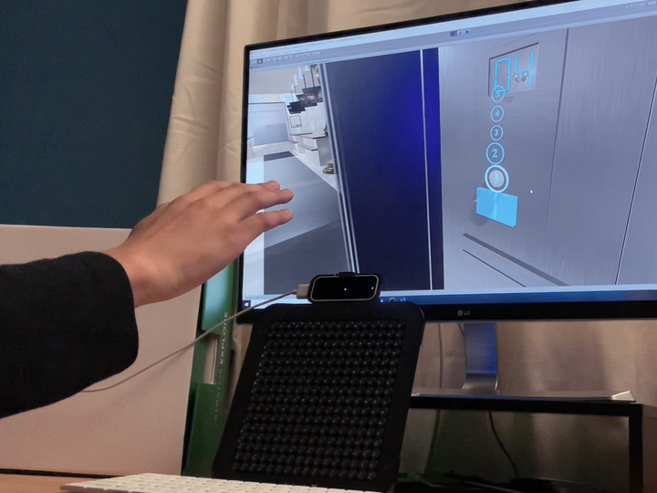
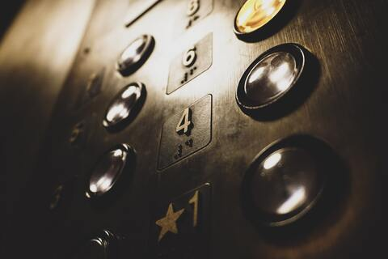
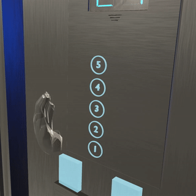
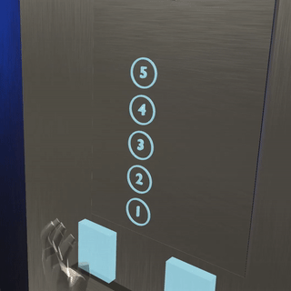
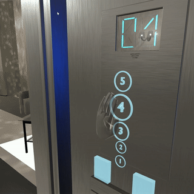
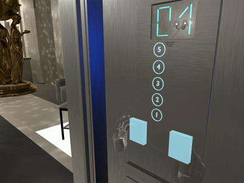

# Touchless Elevator
By Tanay Singhal and Mahika Phutane

License: [Apache License, Version 2.0](LICENSE).

Source code for our submission to the [Developer Competition: Beyond Touchscreens](https://www.ultraleap.com/company/news/events/developer-competition-2020/).

See YouTube video here: https://www.youtube.com/watch?v=wYpcyULBc30.

We present a futuristic concept for a touchless elevator with mid-air haptics that is accessible, intuitive, and fun. Informed by cutting-edge human-computer interaction (HCI) research, our design features touchless tactile braille (as well as audio feedback) for the visually impaired, intuitive gestures for opening/closing doors, and a lively button magnification on hover for improved accuracy. Our concept aims to drive the conversation on revolutionizing today’s physical interfaces with virtual tactile interfaces.

## How to Play
Please download a build from [releases](https://github.com/TanaySinghal/Touchless-Elevator/releases). At the moment, we only have builds for Windows.

## How to Develop
This was made using Unity 2019.1.14f1
1. Clone this repository using `git@github.com:TanaySinghal/Touchless-Elevator.git`
2. Open in Unity -- the source code is all yours now :)

## What SDKs does this use?
- Leap Motion Orion (4.0.0)
- Leap Motion Unity Modules (4.4.0)
- Leap Motion Interaction Engine (1.2.0)
- UltraHaptics C# SDK (did not use UCA)

All haptic sensations are produced using [Time Point Streaming](https://developer.ultrahaptics.com/knowledgebase/time-point-streaming/) so that we can draw tactile shapes that feel continuous. We use this to render tactile elevator buttons and braille dots.

I (Tanay Singhal) wrote my own little framework on top of the UltraHaptics C# SDK to manage tactile shapes, as well as render them visually. I found this easier to work with than the UCA framework.

## Design Justifications

### Why Elevators?

We often ignore elevators, but they are one of the biggest sources of bacterial contamination, even in a non-COVID-19 world. Kandel et al. (2014) show that elevator buttons present a major unrecognized source of bacterial colonization in hospitals. Al-Ghamdi et al. (2011) collected swabs from computer keyboards, mice, elevator buttons, and shopping carts to test for bacterial growth. They found that elevator buttons produced the highest rate of bacterial contimation (97%)! There is even evidence that [hospital elevator buttons show more germs than toilet stall surfaces](https://www.cbc.ca/news/health/hospital-elevator-buttons-show-more-germs-than-toilet-stall-surfaces-1.2699911).

Elevators are essential to anyone who lives in an apartment or has accessibility requirements. On average, a single elevator in the USA carries an average of 20,000 people per year. Together, all elevators combined make more than 18 billion passenger trips! [(Source)](http://www.neii.org/presskit/printmaster.cfm?plink=NEII%20Elevator%20and%20Escalator%20Fun%20Facts.cfm)

### Mid-Air Braille

When your hand is near a button, you will feel the number it represents as a braille character. The braille dots are drawn as single points, one-by-one. We based this technique on research by Paneva et al. (2020), who found that rendering braille dots one-by-one was easier to recognize (94% accuracy) than rendering all dots at once. The paper also describes the exact length of time that each dot should appear, the temporal length of pauses between dots, and the distances between dots. We used their parameters to inform our design.

There is also audio feedback to supplement the braille feedback that says "selecting floor 4".

### Magnification on Hover

The paper by McGuffin et al. (2005) shows that when trying to select a target, users benefit if the target expands. We based our interaction off the Dock on a Mac, which magnifies as you hover over an item. This feature is especially helpful in a scenario with 15+ floors -- our approach would easily scale to that many buttons. 

### Tactile Feedback on Button Press

When you press an elevator button, you will feel mid-air touch sensations to provide feedback that you pressed it. The transparent white cylinder over the button visualizes what I feel on my hand. 

### Re-Inventing Interactions

Virtual interfaces are flexible and programmable, allowing us to rethink many of our physical interactions. Have you ever pressed the close button by accident when you meant to open the door for someone? We present a more intuitive gesture-based interaction for controlling elevator doors.

## The Future and Our Hope
Our design intends to leave you with even more questions than you came here with. Should elevator buttons automatically resize and move depending on an individual’s height and needs? Must elevator controls remain in a corner on the wall — could they instead move to passengers? Could virtual elevator controls encourage or even enforce social distancing? **The future is exciting.**

## Papers Cited
- Al-Ghamdi, A. K., Ashshi, S. A. A., Faidah, H., Shukri, H., & Jiman-Fatani, A. A. (2011). Bacterial contamination of computer keyboards and mice, elevator buttons and shopping carts. African Journal of Microbiology Research, 5(23), 3998-4003. https://academicjournals.org/journal/AJMR/article-abstract/0C6929214156
- Kandel, C. E., Simor, A. E., & Redelmeier, D. A. (2014). Elevator buttons as unrecognized sources of bacterial colonization in hospitals. Open Medicine, 8(3), e81. https://www.ncbi.nlm.nih.gov/pmc/articles/PMC4242253/
- McGuffin, M. J., & Balakrishnan, R. (2005). Fitts' law and expanding targets: Experimental studies and designs for user interfaces. ACM Transactions on Computer-Human Interaction (TOCHI), 12(4), 388-422. https://dl.acm.org/doi/pdf/10.1145/1121112.1121115
- Paneva, V., Seinfeld, S., Kraiczi, M., & Müller, J. (2020). HaptiRead: Reading Braille as Mid-Air Haptic Information. https://arxiv.org/abs/2005.06292
